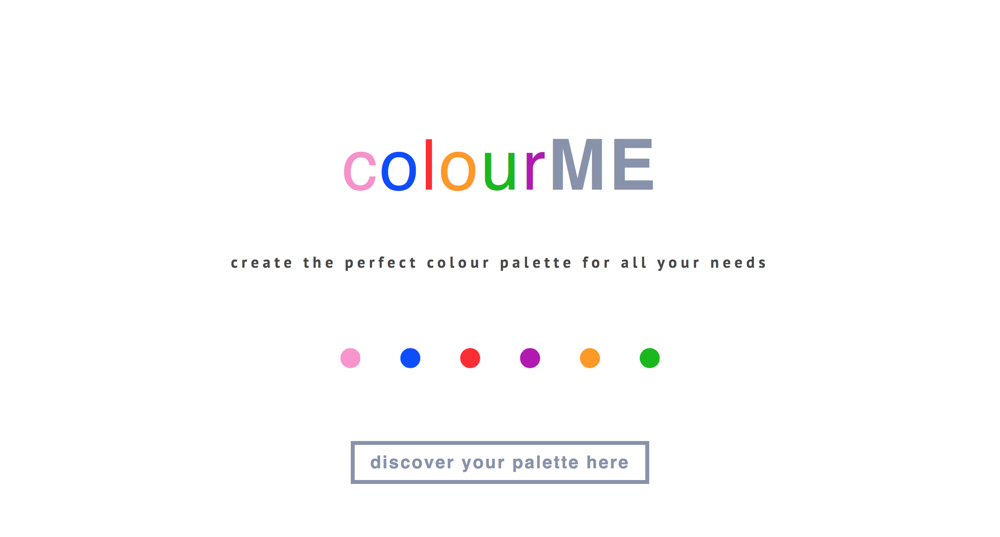
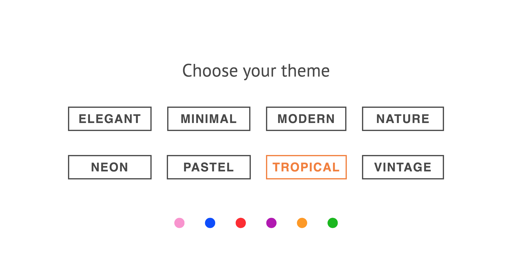
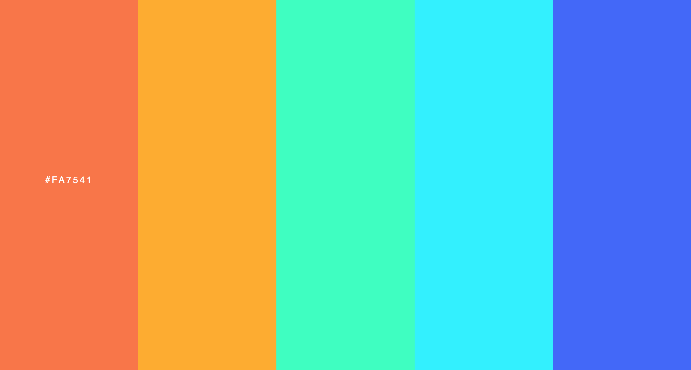
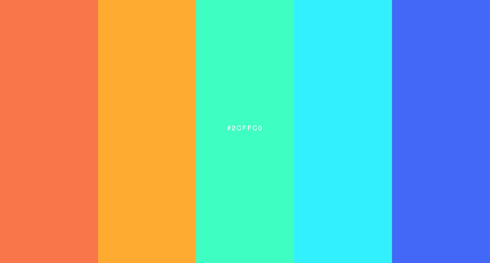
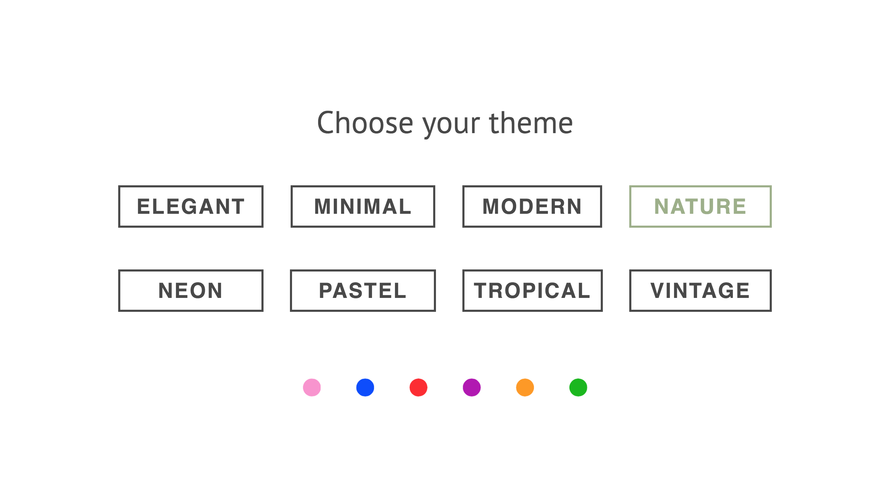
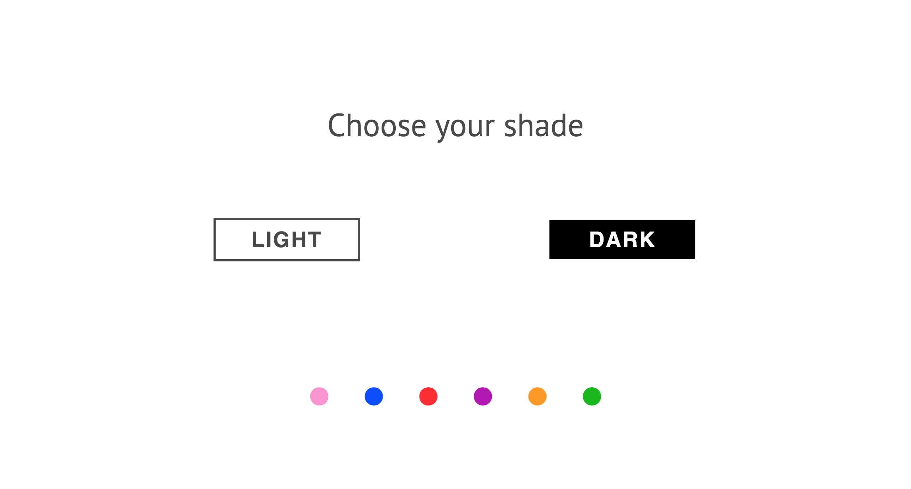
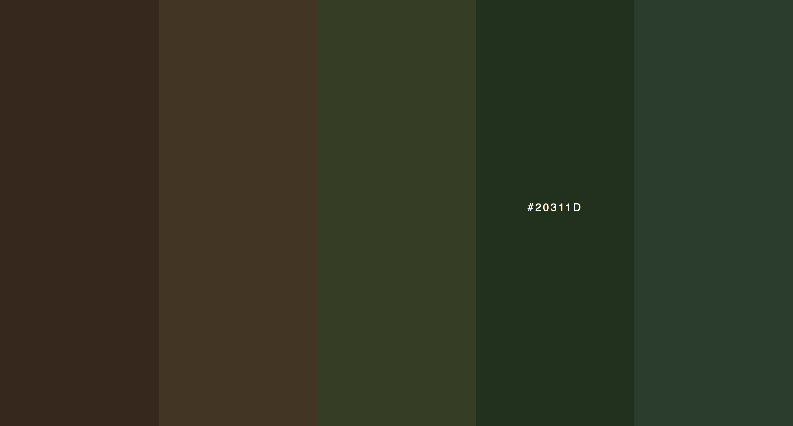
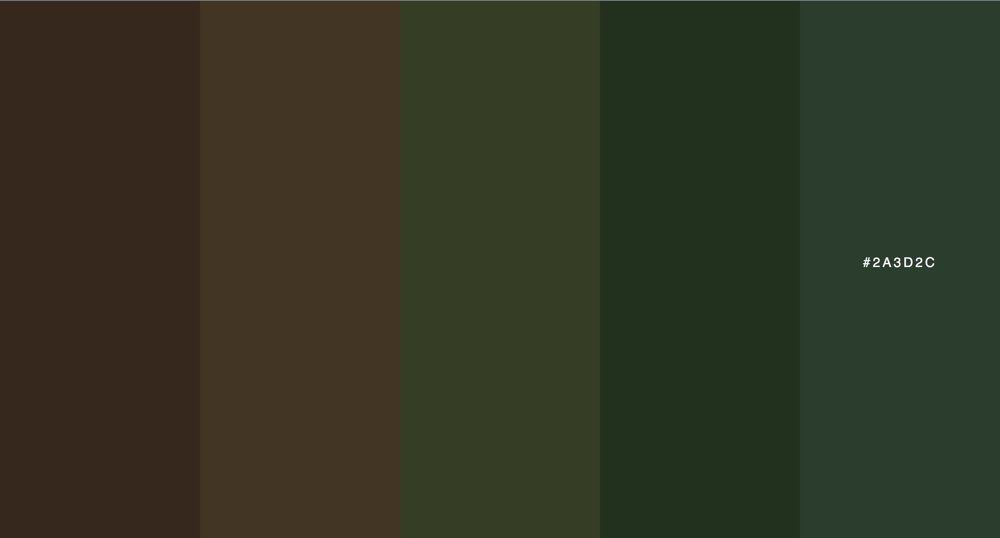

# ColourME

A colour palette generator based off the user's preference. This website was created using ReactJS, JavaScript, HTML, and CSS. For the perfect palette, the user chooses their theme and shade, which then generates a colour palette that consists of five colours. The user can obtain the hex code of each specific colour by hovering over the colour in the palette.

Here is a demo of how each palette is generated.

